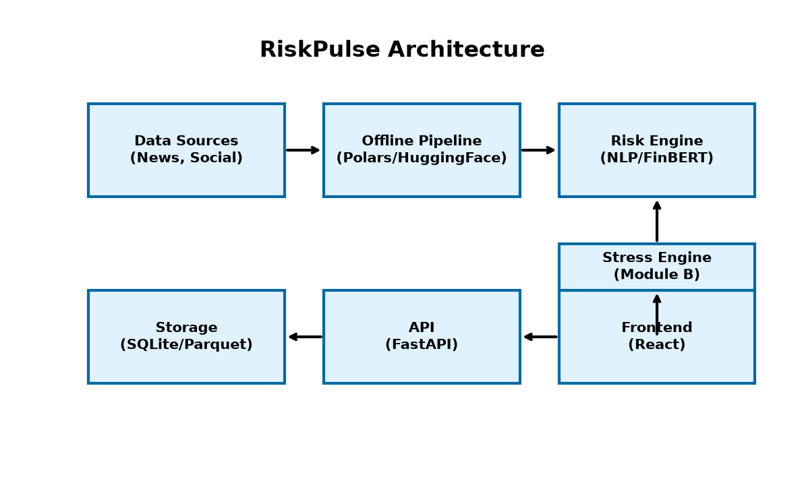

# RiskPulse

An end-to-end financial risk intelligence platform designed for the **Code to Connect: S&P Global and Crisil | Hackathon 2026**.

**Candidate:** Snehansh Khanna  
**College:** VIT Vellore  
**Email:** snehansh.khanna2023@vitstudent.ac.in

---

## 📽️ Demo Video
[Insert YouTube Unlisted Link Here]

## 📊 Presentation Deck
[docs/presentation.pdf](docs/presentation.pdf)

## 🏗️ Architecture

For more details, see [Architecture documentation](docs/architecture.md).

---

## 🎯 Case Study Resolution
This repository is the result of solving the hackathon case study. It ingests unstructured text, processes it using a robust NLP pipeline (FinBERT + sentence-transformers), scores it for risk severity via an explainable hybrid formula, and streams it to **Module B (Portfolio Stress Engine)**.

### Data Provenance
We adhere strictly to the following data categorization:
* **LIVE**: Real-time integration via external endpoints.
* **REPLAY**: Offline processed batch feeds used for demonstrations (sourced from `zeroshot/twitter-financial-news-topic` and `zeroshot/twitter-financial-news-sentiment`).
* **SYNTHETIC**: Auto-generated wholesale banking portfolio of ~300 positions.

---

## 🚀 Quickstart

**Requirements**:
- Python 3.11+
- Node.js 18+

### 1. Setup Backend
```bash
# Create virtual environment and install dependencies
uv venv --python 3.11
uv pip install -r requirements.txt

# Download ML Models
python scripts/download_models.py

# Seed synthetic portfolio & data
python -m src.cli seed
```

### 2. Setup Frontend
```bash
cd src/frontend
npm install
```

### 3. Run the Application
Start the API Backend:
```bash
# Terminal 1
uv run uvicorn src.api.main:app --port 8000
```

Start the Vite Frontend:
```bash
# Terminal 2
cd src/frontend
npm run dev
```

Navigate to `http://localhost:5173` to view the Dashboard.
Toggle between **LIVE** and **REPLAY** in the UI to demonstrate data ingest capabilities.
